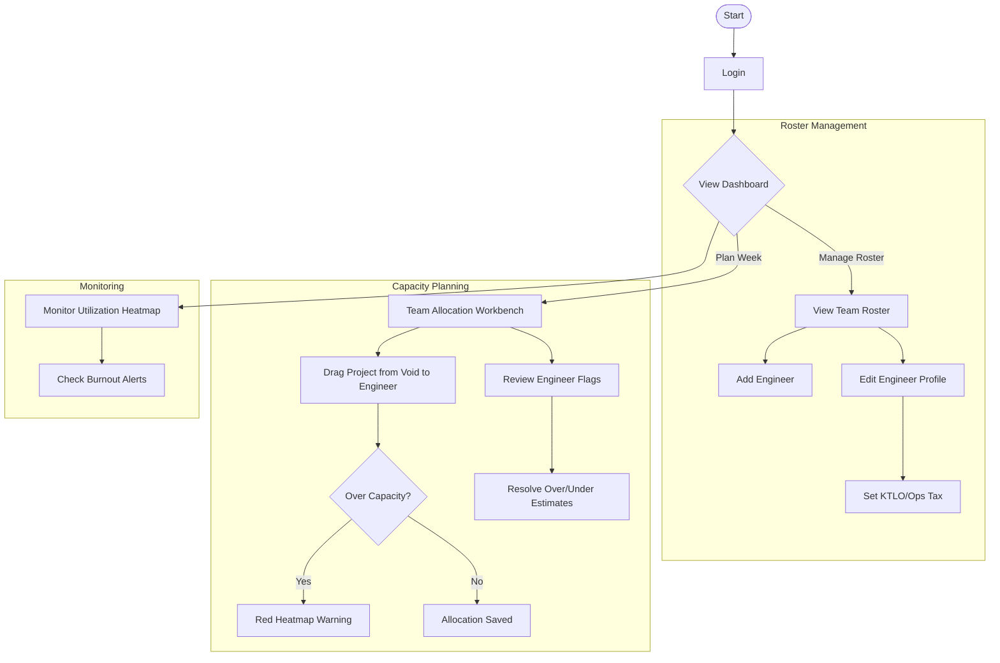
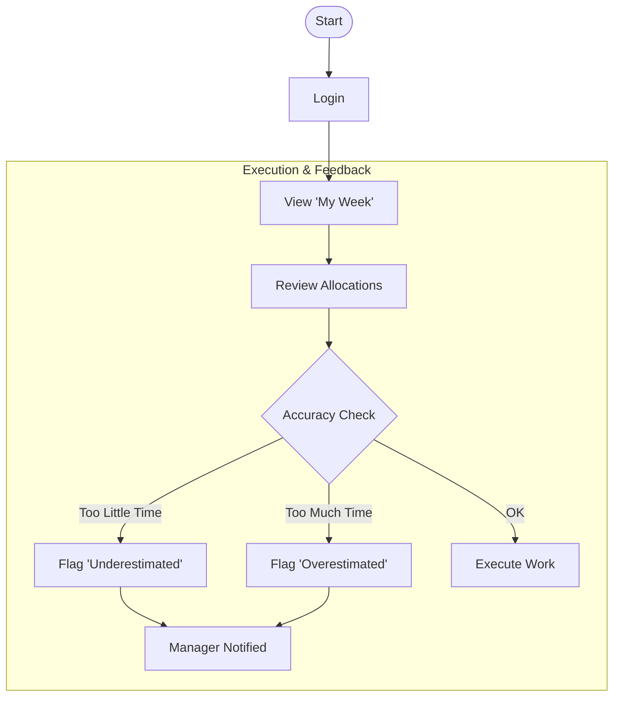
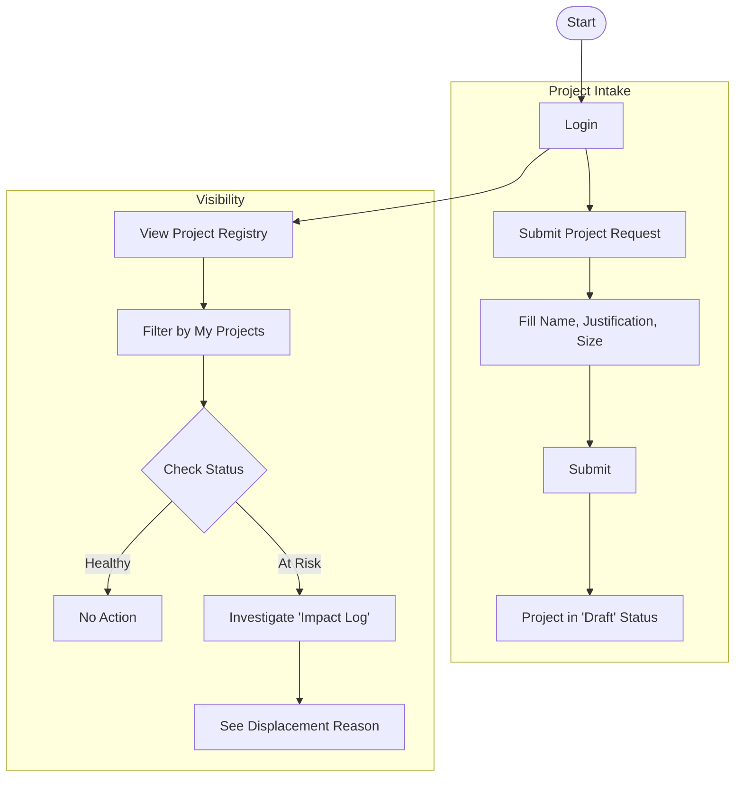
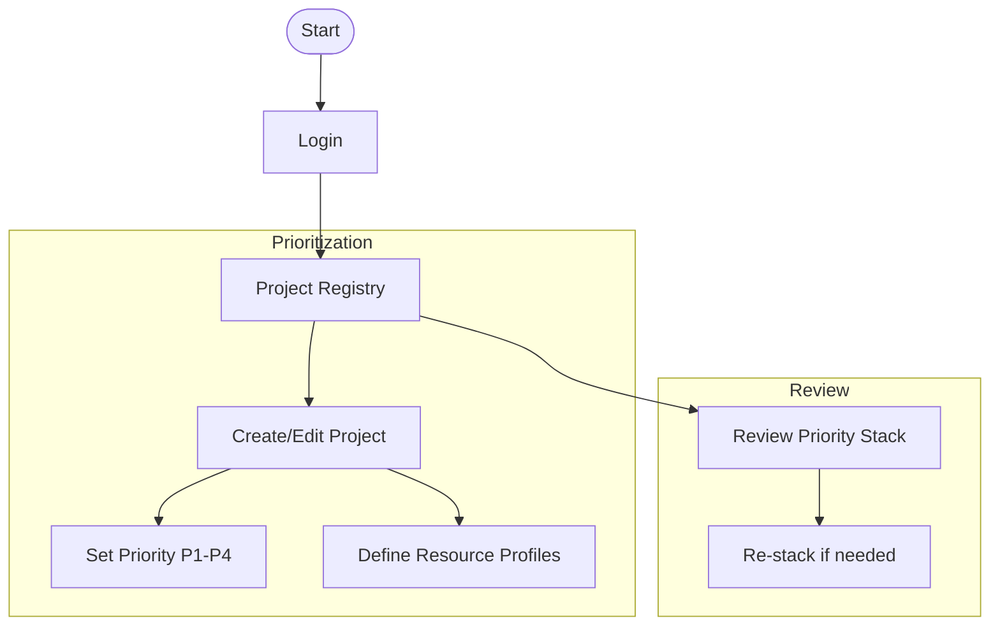
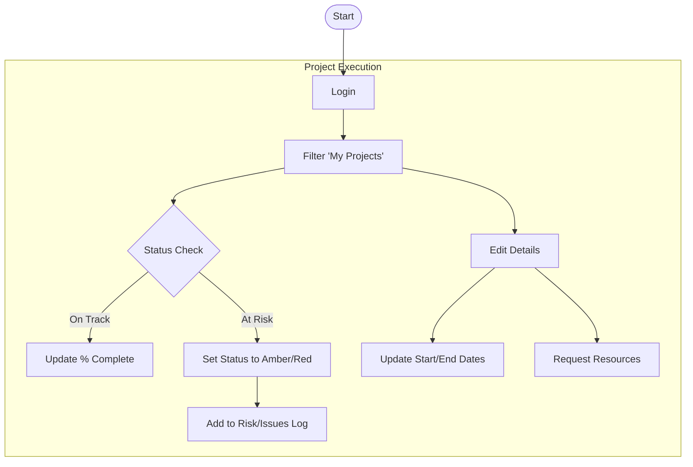
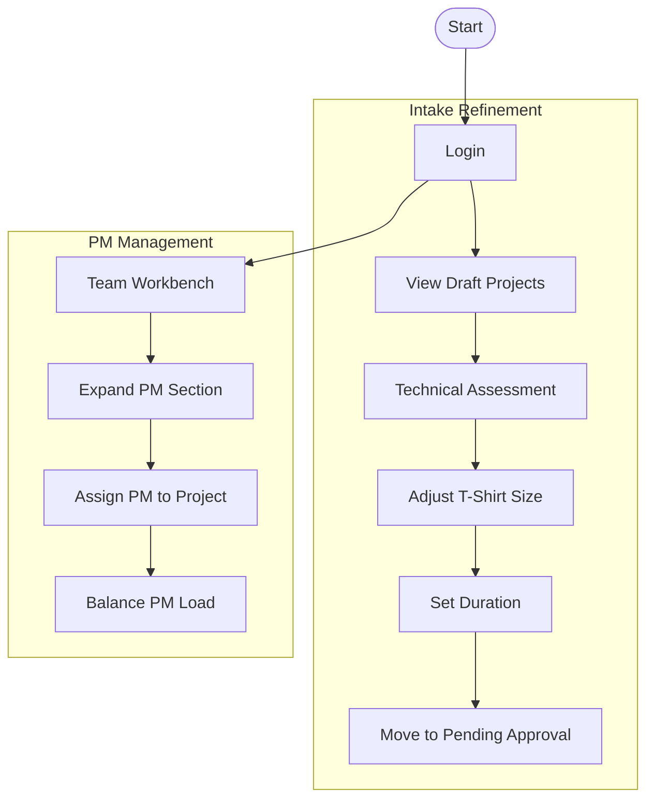

# Workflow Diagrams: Network Engineering Resource Manager

This document outlines the core workflows for each key end-user profile identified in the User Stories.

## 1. Network Manager / Ops Lead
**Goal:** Manage team roster, assign work, and monitor capacity.



## 2. Network Engineer
**Goal:** View schedule, execute work, and provide feedback.



## 3. Senior IT Leader / Stakeholder
**Goal:** Submit requests and track project status.



## 4. Principal Network Architect
**Goal:** Define priorities and technical requirements.



## 5. Project Manager
**Goal:** Deliver projects on time/budget and manage risks.



## 6. Director / AVP
**Goal:** Approve work, high-level planning, and budget justification.

```oermaid
graph TD
    Start([Start]) --> Login
    
    subgraph "Approval Workflow"
        Login --> Pending[View Pending Projects]
        Pending --> Review[Review Justification & Size]
        Review --> LinkApptio[Link Apptio ID]
        LinkApptio --> Decision{Approve?}
        Decision -->|Yes| Approved[Move to Backlog]
        Decision -->|No| Reject[Reject/Request Info]
    end
    
    subgraph "Strategic Planning"
        Login --> Scenario[Scenario Builder]
        Scenario --> Clone[Clone Live Plan]
        Clone --> Sim[Simulate 'Add Headcount']
        Sim --> ViewDelta[View Impact on 'The Void']
        
        Login --> Reports[Compliance Reports]
        Reports --> Justify[Budget Justification Report]
    end
```

## 6. Resource Manager
**Goal:** Refine intake and manage PM capacity.


